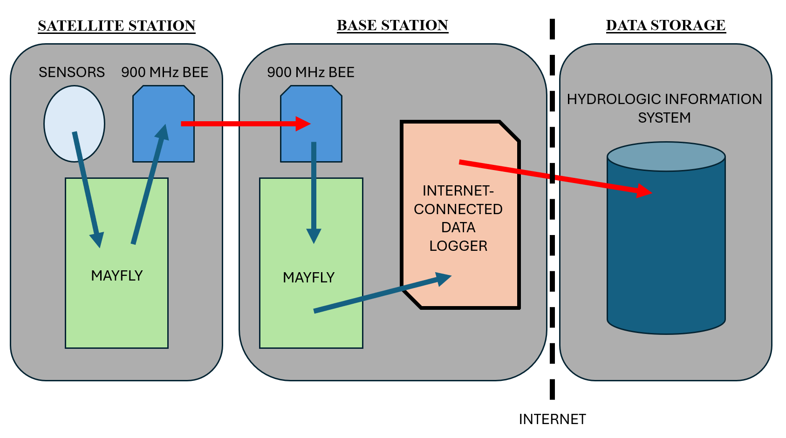

### Integrations

This directory contains the code needed for telemetring data from a snow station that does not have cellular connection to a Hydrologic Information System (HIS). Here a base station (sometimes referred to as the "host" in some of the code in this repository) aggregates data from any number of snow stations that don't have cell service, named satellite stations from here on out. This is done by using 900 MHz spreadspectrum radios to get data from a satellite snow station where there is no cell service to a base station where there is. A base station could also be an existing weather station that has its own method of connecting to an HIS.

The following figure illustrates the role of a base station in getting data published to an HIS when a snow station is setup in an area without cell service.

There are three principal components outlined in the figure:
1. The satellite station, which is a snow station making measurements but that cannot post the data to an HIS on its own for lack of cell serivce
2. The base station, which aggregates data from any number of satellite stations and is capable of posting to an HIS
3. The data storage, which is the HIS that is accessed over the Internet
The arrows indicate the flow of data, with blue arrows being wired connections and red arrows being wireless connections.
The basic approach is that a Mayfly at the base station will aggregate data from all the satellite snow stations and push that data to a data logger that is already connected to an HIS. The 900 MHz Bees in the figure are the modems that help communicate data from a satellite station to a base station.

The contents of this directory address the Mayfly and Internet-connected data logger components of the base station. The 900 MHz Bee used for this design is the [Digi XBee S3B](https://www.amazon.com/gp/product/B07G1XQ1BS/ref=ppx_yo_dt_b_search_asin_title?ie=UTF8&psc=1). Instructions on setting up the XBee for the base Mayfly is the same as the satellite Mayfly, whose instructions are found in step 2 of hardware setups [here](../mayfly_datalogger/README).

Folder summaries
- **[central_station](central_station)**: while there are two dataloggers physically located where the central station is (one Mayfly and one Campbell Scientific datalogger), this folder specifically contains just the Mayfly's code for aggregating data.
- **[cr800](cr800)**: this folder contains the code for a Campbell Scientific CR800 that integrates with an existing network and receives data from the satellite stations through the central station's Mayfly serially. While we are using a CR800 datalogger for this station, several of Campbell Scientific's newer dataloggers could be used with similar code (e.g., CR6, CR1000, CR310, CR350, etc.).
- **[repeater](repeater)**: this folder contains some simple Mayfly code for a repeater station if you need one. Note that a repeater station is not inherently necessary for a functioning network, but may be needed depending on distances between satellite stations and relative to the central station.

Refer to step 5 of the Mayfly datalogger [readme file](https://github.com/CIROH-Snow/snow_sensing/tree/main/code/mayfly_datalogger) in this repository for setup instructions for XBee radio modules if you are using them.
