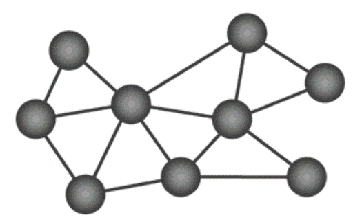

### Base Station and Telemetry for Sites Without Cellular Service

This directory contains the code needed for telemetring data from a snow station that does not have cellular connection to a Hydrologic Information System (HIS). Here a base station (sometimes referred to as the "host" in some of the code in this repository) is a station that has cell service or some other method of connecting to an HIS that aggregates data from any number of snow stations that don't have cell service, named [satellite stations](../mayfly_datalogger/telemetry) from here on out and publishes their data to an HIS. This is done by using 900 MHz spreadspectrum radios to get data from a satellite snow station where there is no cell service to a base station where there is.

The hardware and code used in setting up a telemetry network like this is designed to use mesh networking. Essentially this means that any station within the network will aid in sending data to its specified destination. The following GIF from Digi illustrates this concept:

In this figure, each node, except node B, represents a satellite snow station where snow data is measured and recorded. Node B is the Base station where all the data will go to be published to an HIS. In mesh networking, each satellite station can send its data to the base so long as there exist a chain of stations that can span the gap if distances are too large between a satellite and the base or if there are obstructions, such as trees or terrain. Also in mesh networking, if one station goes down that was previously helping to relay data to the base, the satellite stations will reroute. Note that if in your implementation your satellite station cannot communicate with the base, and you do not wish to install more satellite snow monitoring stations to help bridge the gap, you can build a repeater station which will just help relay data rather than make measurements. This is discussed below.

Once the information reaches the base station, the base station publishes the data to an HIS. The following figure illustrates the role of a base station in getting data published to an HIS when a snow station is setup in an area without cell service and the various components involved.

There are three principal components outlined in the figure:
1. The satellite station, which is a snow station making measurements that cannot post the data to an HIS on its own for lack of cell serivce
2. The base station, which aggregates data from any number of satellite stations and is capable of posting to an HIS
3. The data storage, which is the HIS that is accessed over the Internet
The arrows indicate the flow of data, with blue arrows being wired connections and red arrows being wireless connections.
The basic approach is that a Mayfly at the base station will aggregate data from all the satellite snow stations and push that data to a data logger that is already connected to an HIS. The 900 MHz Bees in the figure are the modems that help communicate data from a satellite station to a base station.

The contents of this directory address the Mayfly and Internet-connected data logger components of the base station. The 900 MHz Bee used for this design is the [Digi XBee S3B](https://www.amazon.com/gp/product/B07G1XQ1BS/ref=ppx_yo_dt_b_search_asin_title?ie=UTF8&psc=1). Instructions on setting up the XBee for the base Mayfly is given below. Note that this is the same for the satellite Mayfly, which is discussed as step 5 in its README file found [here](../mayfly_datalogger/README.md).

#### Hardware needed to successfully program the XBee for a base station Mayfly:
- Mayfly datalogger: [EnviroDIY Link](https://www.envirodiy.org/product/envirodiy-mayfly-data-logger/)
- USB to USB-C cable (make sure it has a data line on it and that it isn't just a charging cable): [Amazon Link](https://www.amazon.com/Anker-2-Pack-Premium-Samsung-Galaxy/dp/B07DD5YHMH/ref=sr_1_1?crid=OCEUG0LMDYLP&dib=eyJ2IjoiMSJ9.IcOZhxxaDPccd7D_9PJSez4TC7ZeslNm1EJdKPeQneHBEF-uoIV7LasPMxWyuM_Vya40K-iyPyMg6v_H45wy6mzKXxt6s3OYqWP5zhy1B9J-1LUpHezs29_rckwloWXBiXYf8MJ05P_svLPunlYzUe7gQfveNh-Zn7VBKaGt_9iWLG-n9virw4ACfWX6lJk2vqfw9e2OuA637VG6T4SehBXUF63MhLmMbi_0Qzeq_wo.LhyREBSKszocFqOQPSyZ6cSP8CXedu0OlJd6lyo4osc&dib_tag=se&keywords=usb+to+usb+c+cable&qid=1731527951&sprefix=usb+to%2Caps%2C163&sr=8-1)
- Sparkfun Bee explorer board: [SparkFun Link](https://www.sparkfun.com/products/11812)
- USB to mini USB cable (or whatever the Sparkfun Bee expolorer board USB port is; likewise make sure it isn't just a charging cable but that it has data transfer capabillities): [Amazon Link](https://www.amazon.com/Amazon-Basics-Charging-Transfer-Gold-Plated/dp/B00NH11N5A/ref=sr_1_1?crid=1Z0FIFVVCXG0W&dib=eyJ2IjoiMSJ9.shJPkvHWsKPPj2XvYAPBmNL50UHskMqo16gwTKuFBExp4vatt4_0_judiSkXn9R6tbDUb6a3kQqJNT5YGJOsxUhNdQeKjHa2TSXLJMGJsOYR2U7iZSGto64mWcN8Ry-DeZc0ZJN7BWq3frLdTGhZROKR3tVtsDp0j_9M-VZgzCQyn5KyGpybJtvbnLpKkE27-dP30L9B274XFoM36szpTkp7nA3GOI8wVNV5Ls5fB40.ROudX9YX1I-bUxWiohZX6eGvnMZE8h9sToyxZ6urNi4&dib_tag=se&keywords=usb+to+mini+usb&qid=1731528058&sprefix=usb+to+mini+usb%2Caps%2C140&sr=8-1)

#### Steps to program the XBee
1. Download the XCTU software for interfacing with the XBee modules
	1. Click on the link: https://www.digi.com/products/embedded-systems/digi-xbee/digi-xbee-tools/xctu
	2. Click on the button: "Visit Support to Download XCTU"
	3. Scroll down to "Product Resources"
	4. Under "Resources and Utilities" select the XCTU link for your operating system and follow the instructions
2. You will want an explorer board from sparkfun in order to easily interface with XCTU (https://www.sparkfun.com/products/11812)
	1. Note that there are other explorer boards you can get, but make sure you can obtain the necessary cables for powering and using serial communication
3. Attach your XBee S3B to the explorer making sure to match the board's geometry to the white outlines on the explorer
4. Attach the board to your computer. If you get a different explorer board, note that you may need to supply power externally, such as with a barrel jack and wall plug.
5. Open the XCTU software
6. In the top left, select the button showing a module with a magnifying glass over it to discover the radio module
7. Select the port the radio is connected to
8. Press Next
9. Make sure the following settings are set:
	1. Baud Rate: 9600
	2. Data Bits: 8
	3. Parity: None
	4. Stop Bits: 1
	5. Flow Control: None
10. Press Finish
11. A list of discovered devices should appear. If this does not work, hit cancel and try to add the radio module in the home page by selecting the button with the + sign and using the same parameters
12. Select your device and press "Add selected devices"
13. You should be taken back to the home page where your device is listed on the left
14. Click on the module from that list (it should highlight orange when selecting it), avoiding the buttons on the right side
15. This will open up all the radio settings.
16. Under MAC/PHY settings, set Network ID (ID) to something significant to you that all radios will be on. Note that if two radios' network IDs do not match, they will not be able to communicate.
17. Under MAC/PHY settings, set Unicast Mac Retries (RR) to F
18. Under Network settings, set Mesh Unicast Retries (MR) to 5
19. Under Addressing settings, set the Node Identifier (NI) to something meaningful such as the name of the station the module will be placed on
20. Under Addressing settings, make sure that the Transmit Options (TO) is set to C0 (DigiMesh)
21. Under Serial Interfacing options, set API Enable (AP) to API Mode Without Escapes
22. Under Sleep Commands, set Sleep Mode (SM) to Async. Pin Sleep
23. Save these changes by pressing the "Write" button at the top
24. Your XBee is programmed, so clear it from the list on the left by clicking the module's "X" button
25. Unplug the cable from your computer or explorer before removing the XBee from the explorer

#### Folder summaries
Folders in this directory are broken down into the components of the base station, mayfly and internet-connected data logger. An additonal folder is given titled "repeater". A repeater station is an intermediary station between satellite and base that helps to relay data from satellite to base in the case a direct connection cannot be established. Any number of repeater stations can be set up to help relay data from one location to another. The code for it is found in its folder.

- **[internet-connected-datalogger](internet-connected-datalogger)**: This folder contains example code for two different data loggers connected to an HIS that give satellite snow station data to an HIS
- **[mayfly](mayfly)**: This folder contains the code for the Mayfly that collects all the data from satellite snow stations and pushes that data to an Internet-connected data logger. The two examples given in this folder correspond to code in the [internet-connected-datalogger folder](internet-connected-datalogger).
- **[repeater](repeater)**: This folder contains some simple Mayfly code for a repeater station if you need one. Note that a repeater station is not inherently necessary for a functioning network. 
