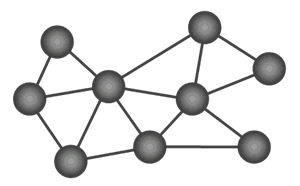

# Base Station and Telemetry for Satellite Stations Without Cellular Service

This directory contains the code needed for telemetring data from a snow sensing station that does not have a cellular data connection to a Hydrologic Information System (HIS). Here a base station (sometimes referred to as the "host" in some of the code in this repository) is a station that has cellular data service or some other method of connecting to a HIS. A base station aggregates data from any number of snow sensing stations that don't have cellular data service, named [satellite stations](../mayfly_datalogger/telemetry) from here on out, and publishes their data to a HIS. This is done by using 900 MHz spread spectrum radios to get data from a satellite snow sensing station where there is no cellular data service to a base station where there is some method of connecting to the Internet, whether through cellular data service or some other method.

The following figure illustrates the role of a base station in getting data published to a HIS when a snow sensing station is setup in an area without cellular data service and the various components involved.

There are three principal components outlined in the figure:

1. The satellite station, which is a snow sensing station making measurements that cannot post the data to a HIS on its own for lack of cellular data service.
2. The base station, which aggregates data from any number of satellite stations using a Mayfly datalogger and is capable of posting to a HIS using a separate, Internet-connected datalogger.
3. The data storage, which is the HIS that is accessed over the Internet.

The arrows indicate the flow of data, with blue arrows being wired connections and red arrows being wireless connections. The basic approach is that a Mayfly datalogger at the base station will aggregate data from all satellite snow sensing stations and then push that data to a separate datalogger that is connected to a HIS (either via cellular data or some other connection). The 900 MHz Bees in the figure are the radio modules that help communicate data from a satellite station to a base station.

**NOTE:** A base station requires two dataloggers. In the case where the base station is using Mayfly dataloggers, two are required because the Bee radio module socket can only be occupied by one radio module. Thus, a Mayfly datalogger is needed to recieve data via 900 MHz spread spectrum radio from satellite stations and then a second Mayfly datalogger is needed to transmit data via a LTE Bee radio to send data to a HIS using a cellular data connection. In the case where the Internet-connected datalogger is a Campbell Scientific datalogger, a Mayfly datalogger is needed to receive data via 900 Mhz spread spectrum radio from satellite stations and then it pushes data into the Campbell Scientific datalogger so that the data can be retrieved over whatever telemetry network the Campbell Scientific datalogger is connected to. 

## Mesh Networking

The hardware and code used in setting up a telemetry network like this is designed to use mesh networking. Essentially this means that any station within the network will aid in sending data to its specified destination. The following image from Digi illustrates the mesh networking concept:

In this figure, each node, except Node B, represents a satellite snow sensing station where data is measured and recorded. Node B is the base station where all the data will go to be published to a HIS. In mesh networking, each satellite station can send its data to the base station so long as there exists a chain of stations that can span the gap if distances are too large between a satellite and the base or if there are obstructions, such as trees or terrain. Also in mesh networking, if one station goes down that was previously helping to relay data to the base, the satellite stations will reroute. Note that if in your implementation your satellite station cannot communicate with the base, and you do not wish to install more satellite snow monitoring stations to help bridge the gap, you can build a [repeater](repeater) station that will just help relay data rather than make measurements. This is described in more detail below.

The contents of this directory address the Mayfly datalogger and Internet-connected datalogger components of the base station. The 900 MHz Bee used for this design is the [Digi XBee S3B](https://www.amazon.com/gp/product/B07G1XQ1BS/ref=ppx_yo_dt_b_search_asin_title?ie=UTF8&psc=1). Instructions for configuring the XBee for the base station Mayfly datalogger are the same as the instructions for configuring the XBee for the satellite station Mayfly datalogger and are given in step 7 in the README file found [here](../mayfly_datalogger/README.md#7-program-xbee-radio-modules-optional). We do not repeat those steps here, but you should use them to configure the XBee radio module.

## Folder summaries

Folders in this directory are broken down into the components of the base station, which include the Mayfly datalogger and the Internet-connected datalogger (which could be any datalogger). An additonal folder is provided with code for a "repeater" station. A repeater station is an intermediary station that helps to relay data from satellite stations to a base station in the case where a direct connection cannot be established and no other satellite station can relay the signal from the remote satellite station to the base station. Any number of repeater stations can be set up to help relay data from one location to another. The code for it is found in its folder.

* **[internet-connected-datalogger](internet-connected-datalogger)**: This folder contains example code for two different dataloggers that caan be connected to a HIS to push data from a network of satellite snow sensing stations into the HIS for data management and sharing. Options include:
	* Using a Campbell Scientific CR800 datalogger as an example of how to connect snow sensing stations to an existing telemetry network
	* Using a Mayfly datalogger connected to an LTE Bee radio to send data to an HIS directly using a cellular data connection.
* **[mayfly](mayfly)**: This folder contains code for using a Mayfly datalogger as part of a base station that collects all the data from satellite snow sensing stations and pushes that data to an Internet-connected data logger. The two examples given in this folder correspond to code in the [internet-connected-datalogger folder](internet-connected-datalogger).
	* push_to_cr800: This example shows how to push data from a Mayfly datalogger at the base station to a CR800 datalogger that is connected to an existing telemetry system
	* push_to_mayfly_lte: This example shows how to push data from a Mayfly datalogger at the base station to a separate Mayfly datalogger that then sends the data to a HIS using a cellular data connection. 
* **[repeater](repeater)**: This folder contains code for using a Mayfly datalogger as a repeater station in your network if you need one. Note that a repeater station is not necessary for a functioning network - they are only needed in situations where there is no available radio path from a satellite station to the base station either due to distance or obstructions. 
