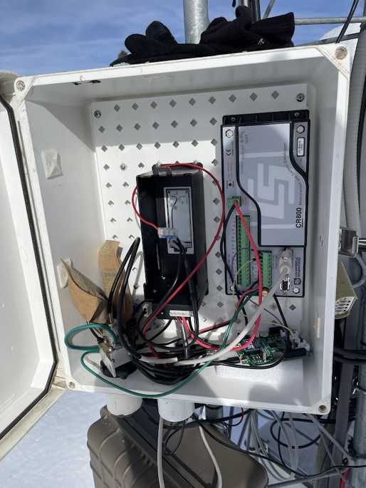
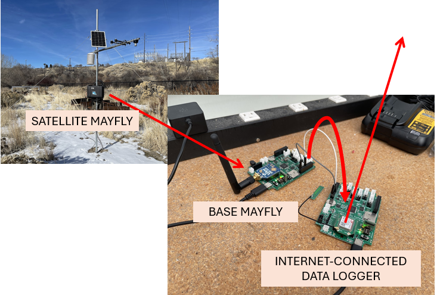
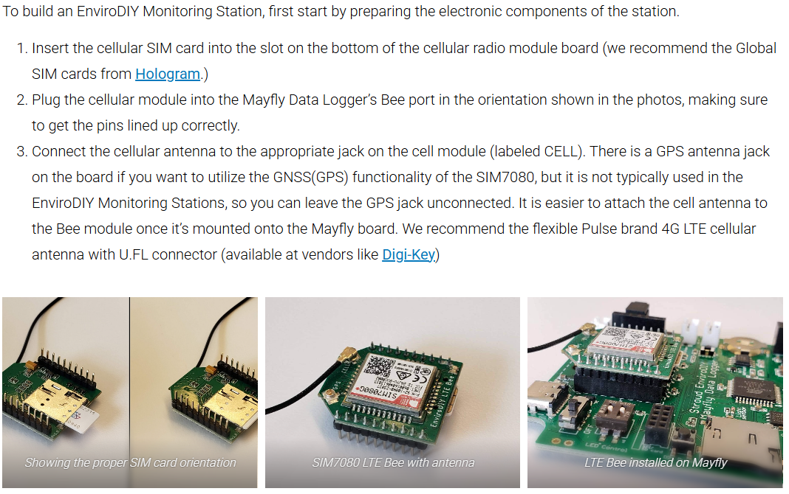

## Example Code for Internet-Connected Data Loggers

Two examples are given in this folder, and each has associated code for the [Satellite station](../../mayfly_datalogger/telemetry) and [Base Mayfly](../mayfly) that you must use for successful deployment. 

### Telemetering Data with Campbell Scientific
The first is for receiving and parsing data into Campbell Scientific (CS) data logger tables using a CR800. We recognize that the CR800 is no longer being sold by Campbell Scientific, but the code here should be adaptable to any other CS data logger.
This assumes that data logger is already connected to a network you've set up on CS LoggerNet. Make sure to use the [push_to_cr800](../mayfly/push_to_cr800) sketch for the Base Mayfly if this is how you will connect to CS HIS and the [satellite_varCode](../../mayfly_datalogger/telemetry/satellite_varCode) sketch for the satellite station Mayfly. You will also need to verify that the variable names the CRBasic code looks for matches all the varCode variables that will be measured on the satellite data loggers.

The following figures show an example of an implementation like this done at the Tony Grove Ranger Station in Logan Canyon in northern Utah. The Base Mayfly is connected to a CR800 that is part of the [Logan River Observatory's](https://uwrl.usu.edu/lro/) climate monitoring network.

In the figure the Mayfly is at the bottom-right of the enclosure, and the CR800 is at the top-left.

### Telemetering Data to HydroServer Using a Mayfly for the Internet-Connected Data Logger
The other example given here is for using a Mayfly (that is separate from the Base Mayfly that aggregates data from every station) that has an [LTE Bee modem](https://www.envirodiy.org/product/envirodiy-lte-bee/) for publishing directly to [HydroServer](https://hydroserver.geoglows.org/browse). The following figure shows an example of how this would look, with a satellite snow station that sends its data to a Base Mayfly over 900 MHz spreadspectrum radio which then pushes that 
data to an internet-connected data logger, which also happens to be a Mayfly in this case.

If you are doing this, you will need to use the [push_to_mayfly_lte](../mayfly/push_to_mayfly_lte) sketch for the Base Mayfly and the [satellite_varUUID](../../mayfly_datalogger/telemetry/satellite_varUUID) sketch for the satellite station.
Make sure to properly set up the LTE Bee before deployment. To do so, you will need to purchase a SIM card. We recommend [Hologram](https://store.hologram.io/). You will need to set up an account before the SIM card will work. Once you receive the SIM card and set up the account, follow the instructions in the following screenshot taken from the first three steps of EnviroDIY's "[Assembling the Mayfly Data Logger Electronics](https://www.envirodiy.org/knowledge-base/building-an-envirodiy-monitoring-station/)" instructions.

