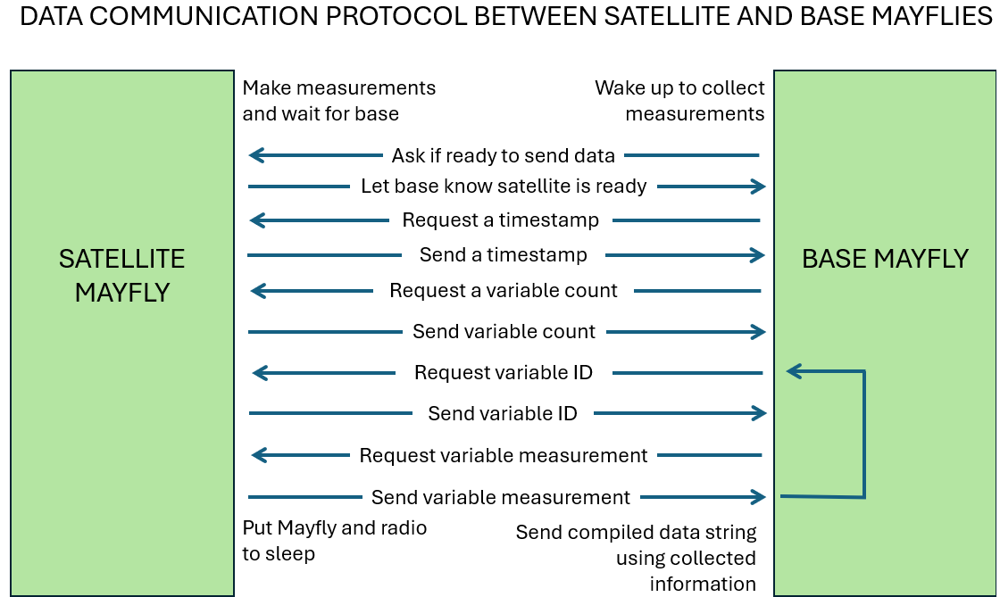

This folder contains two example Arduino sketches for a Base station Mayfly, which is in charge of aggregating all the data from every satellite snow station in a network and pushing that information to an interntet-connected data logger.

In both cases, the Base Mayfly follows a communication protocol with the Satellite Mayfly to collect all the necessary information from a snow station then compiles the data into a structured string. This communication protocol is shown in the following figure.

The Base Mayfly collects a timestamp for the most recent measurement and then requests a variable identifier (either the varCode or varUUID) and associated measurement for each variable measured at the satellite station. The compiled data string takes all the information and formats it into the following structure:

@variableIdentifier=variableMeasurement;

An "@" sign indicates the start of a new data point followed by the identifier for the following phenomena. An "=" sign indicates that the actual measurement is following, and then the data point is terminated by a ";".
An example of this could be: @snowDepth=652;
In this example, the Base Mayfly requested a varCode and received "snowDepth" and then it requested snowDepth's measurement, which was 652, as in 652 mm. All the data points for a satellite station's measurements can be "stacked" in this format.

For example: @timestamp=2025-02-04 11:30:00-7;@snowDepth=652;@airTemp=1.4;

This format is used to compile all the data into one string that can be easily parsed by any data logger over serial connection.

The reason their are two different sketches is that the [Internet-connected data loggers](../internet-connected-datalogger) given in this repository's examples have different ways of parsing the data, and they don't necessarily require the same information to be able to post to their respective HIS. The [Campbell Scientific implementation](../internet-connected-datalogger/cr800), for example, has to have things organized into data tables, so each data table is associated with a station, and therefore the Base Mayfly needs to include in its compiled string the station name.

For example: @station=marshes;@timestamp=2025-02-04 11:30:00-7;@snowDepth=652;@airTemp=1.4;

In the [Mayfly LTE implementation](../internet-connected-datalogger/mayfly_lte), however, the Internet-connected data logger is publishing to HydroServer which only cares about the Universally Unique Identifier (UUID) for each variable, so a station name is not necessary to report. The two Base Mayfly sketches also differ in how they handle letting the Internet-connected data logger know when all the compiled data string for one station has ended.
