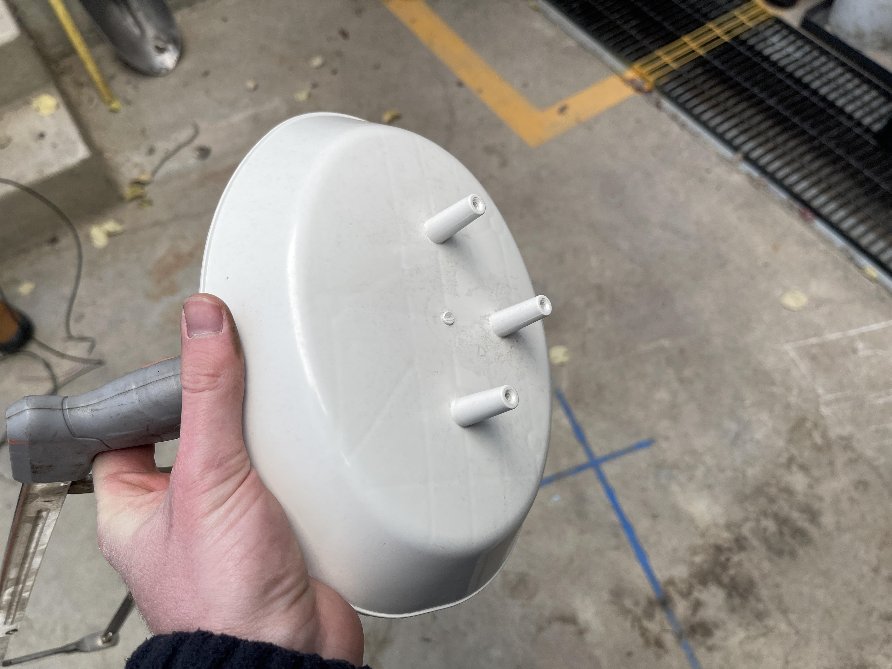
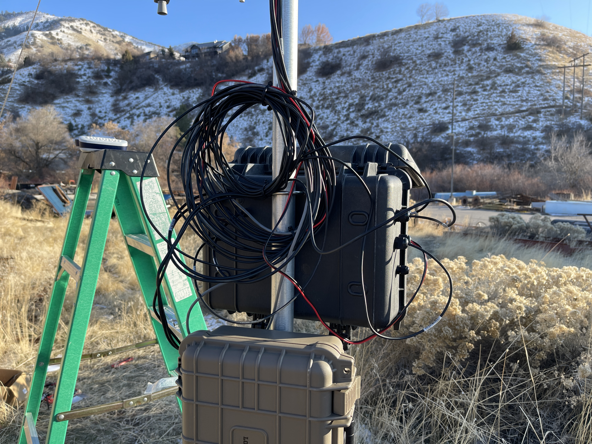

# Construction Guide

This guide provides instructions for constructing the deployment platform for a snow sensing station including the mast and sensor crossarm that will support the sensors, enclosures, solar panels, etc. This document provides instructions for construction of a mast that does not use Campbell Scientific hardware and describes how to assemble sensors and enclosures. If you choose to use a Campbell Scientific tripod, its setup is not discussed in this repository. You will however want to use this guide for all other construction for your station (e.g., sensor crossarm, enclosure mounting, etc.).

## Required Hardware and Tools

The following hardware and tools are not explicitly called out in the hardware spreadsheets but are needed for the successful construction of a snow sensing station:

1. Soil auger
2. USB-C cable with data line
3. Shovel
4. Sledge hammer or fence post pounder
5. Level
6. 1/2 inch wrench
7. 7/16 inch wrench
8. Phillips screw driver
9. Flathead screw driver
10. Drill with large selection of drill bits
11. Hacksaw
12. Label maker

## Low-cost Deployment Platform Setup

The following steps are covered in this guide. Links to the sections are provided here for convenience:

1. [Installing the soil sensors](#1-installing-the-soil-sensors)
2. [Installing the mast and sensor crossarm bracket](#2-installing-the-mast-and-sensor-crossarm-bracket)
3. [Grounding the mast](#3-grounding-the-mast)
4. [Installing the Enclosures](#4-installing-the-enclosures)
5. [Prepare the Radiation Shield for the Temperature Sensor and the Sensor Crossarm](#5-prepare-the-radiation-shield-for-the-temperature-sensor-and-the-sensor-crossarm)
6. [Install the Sensor Crossarm on the Mast](#6-install-the-sensor-crossarm-on-the-mast)
7. [Prepare the MaxBotix Snow Depth Sensor Enclosure](#7-prepare-the-maxbotix-snow-depth-sensor-enclosure)
8. [Assemble the Radiometer Sensor Mounts](#8-assemble-the-radiometer-sensor-mounts)
9. [Install the Solar Panel](#9-install-the-solar-panel)
10. [Secure the Sensor Cables](#10-secure-the-sensor-cables)

### 1. Installing the Soil Sensors

1. Use a soil auger to drill/dig a hole at least 20 inches into the ground near where the mast will be placed but not so close that the u-post supporting the mast for the station will be driven into the sensors. If you do not have a soil auger, you can use a shovel to dig a hole for deploying the soil sensors.

2. If you have not already programmed your Teros 12 soil sensors, you will need to do that now. Follow the instructions of step 4 in the Hardware Setup Steps in the Mayfly Datalogger Code [markdown file](../code/mayfly_datalogger/README.md).

3. Once the soil sensors have been programmed, insert each sensor at their different depths: sensor 'c' at 20 inches, sensor 'b' at 8 inches, and sensor 'a' at 2 inches.

4. Cut about a 3-foot length of flexible aluminum conduit that you can run the sensor stereo jacks through and bury the hole, ensuring not to disturb the sensors and that the end of the flexible conduit is buried so that none of your sensor wires are exposed.

### 2. Installing the Mast and Sensor Crossarm Bracket

1. Take the U-post and begin pounding it into the ground at the location where the vertical mast will go using a sledge hammer or a fence post pounder.

2. Before pounding the u-post in too far, take a level and make sure the post is being driven in vertically by checking that it is straight on all sides.

3. Finish driving in the U-post with enough depth that it feels secure in the ground when pushed around.

4. Add the crossarm bracket to the fence pole mast at the desired height of the sensors. Note that the soil depth sensors cannot make measurements of distances less than 50 centimeters away and more than 5 meters away, so make sure to locate the crossarm at a height that will be able to capture the range of snow depths you can anticipate for your site. The rounded parts of the u-bolts on the bracket go around the mast and the sensor crossarm.

5. Remove the guy-wire bracket from the guy-wire kit.

6. Use a 7/16" wrench and a 1/2" wrench to loosen all the nuts on the bracket.

7. Slide the guy wire bracket over the top of the mast and locate it at a height between the top of the mast and the crossarm bracket. Note that the guy wires will be extending from the eye bolts, so orient them so that they do not interfere with the sensor crossarm. At this point you may also consider capping off the ends of the crossarm and the top of the mast with electrical puddy to prevent bees, hornets, and wasps from making a home in them.

8. Loosen the nuts between the bracket and the top of the copper bolt so that they are not pressed into the bracket.

9. Tighten down the copper bolts until the bracket has sufficiently grabbed onto the mast then tighten the previously loosened nuts to lock the bolts in place. Tighten the eye bolts as well.

10. Place the mast over the u-post making sure to orient the crossarm bracket in the desired direction of the crossarm.

11. Begin assembling the three guy wires. Each guy wire will have an end with an open loop that will be secured in the ground with a stake and an end that is attached to a turnbuckle that is hooked onto the guy-wire bracket. Start by cutting the wire into three equal lengths.

12. Assemble a wire by first loosening a wire clamp with a philips screw driver.

13. Run the end of one wire through the grooves of the clamp to form a loop. Tighten the clamp down on this loop.

14. Decide on where the stake for this wire will go. The wire needs to pull away from the bracket's eye bolts and not induce a torque when pulling on the mast, causing it to twist. Decide approximately the location of the stake and run the wire from that location to the bracket to get the approximate length of wire needed.

15. At that length, make another loop where the turnbuckle will go. Repeat the process of creating a loop and clamping it down, but this time run the loop through one end of the turnbuckle.

16. Loosen the turnbuckle as far as it will go and add the S-hook to the free end of the turnbuckle.

17. Attach the S-hook end of the turnbuckle to the eye bolt of the bracket.

18. Stake down the ground end of the guy wire using a mallet and pull the wire tight, but making sure to keep the mast level.

19. Repeat this process for all three wires.

20. Tighten the turnbuckles to add tension to the wires and level the mast. Note that this may be an interative process of realigning stakes, changing wire lengths, and loosening/tightening turnbuckles to create even and solid tension in all wires while keeping the mast level, and you may need to go back and change things a few times over as you narrow in on the correct dimensions and setup.

### 3. Grounding the Mast

1. Take the mast grounding clamp and open it up.

2. Wrap it around the mast about two feet above the ground and tighten it on with a flat head screw driver.

3. Dig a shallow trench for the grounding rod near the mast and place the rod inside. Note that the grounding rod can be driven vertically into the ground, but this is often more difficult depending on how many rocks there are in the soil. Vertically driven grounding rods are also much more difficult to remove.

4. Place the grounding rod clamp on the end of the grounding rod near the mast and tighten one end of the grounding cable in-between the bolt and the rod.

5. Feed the other end of the grounding cable into the cable hole of the mast grounding clamp and tighten the bolt to attach the cable.

6. Bury the grounding rod.

### 4. Installing the Enclosures

1. Prep the enclosures that will be used. In these instructions, we will have an enclosure that will house the data logger, charge controller, and all other sensing peripherals. Another enclosure will house the battery. You may elect to use larger batteries in different enclosures or to have smaller batteries in the same enclosure as the data logger. If you use a larger battery, such as the 100-Ah lithium iron phosphate batteries, the same principles can apply, but it is suggested that you do not locate the battery enclosure on the mast but rather on the ground due to the weight of the battery.

2. For a separate battery enclosure, drill four holes for U-bolts in the center of the enclosure. In this application, a 35-Ah battery is used, which fits better with a vertically oriented enclosure. Drill two holes on the side of the enclosure and place two cable glands. Note that you may also use one cable gland if you can get both wires that will be used through a single gland and tighten the gland all the way.

3. Mount the enclosure to the mast at an accessible height using the U-bolts that come with plates. The plates will help distribute the pressure caused by the U-bolts over the enclosure's plastic.

4. Place the battery inside.

5. For the data logger enclosure, also drill four holes for the 2 U-bolts that will be used to mount this enclosure in the center. A hole will also be drilled for each of the sensors, the solar panel, and the battery. Select the cable gland sizes that will fit each of these cables and close around them completely. The Teros soil sensors will need larger glands than the others to accommodate the stereo jack. Test these glands on the cables before drilling holes. Once you decide on the cable gland sizes for each of the these items, begin drilling the holes in the locations shown in the image. If you drill something incorrectly, just use electrical putty to fill in the hole as seen in the picture. It is suggested that you label what will be fed through each hole. Also attach the two 9-to-3 cable terminal blocks, power relay, soldered ADCs, and buck converter using command strips in the locations shown.

### 5. Prepare the Radiation Shield for the Temperature Sensor and the Sensor Crossarm

1. Begin prepping the air temperature sensor and crossarm by breaking open the radiation shield kit.

2. Take the top piece of the radiation shield which has three prongs sticking out the top.

3. Use a hacksaw to remove these three prongs.

4. Drill holes down the center of this piece for the U-bolts that came in the radiation shield packet.

5. Slide the crossarm into the U-bolts and tighten the U-bolts to the crossarm.

6. Attach the packet's long threaded rods to each of the three threaded holes in the underside of the top piece of the radiation shield.

7. Slide the next piece over these rods. Use the piece shown in the image.

8. Add another layer of the shield, which will be the same piece as the one just added.

9. Attach the Apogee air temperature sensor to the radiation shield's white sensor mounting rod using the supplied zip ties.

10. Place the sensor mount in the center slot.

11. Feed the layers of the radiation shield that have a large opening in the middle over the air temperature sensor wire.

12. The last piece will be a closed layer.

13. Add the small hex nuts and wing nuts to the threaded rods.

### 6. Install the Sensor Crossarm on the Mast

1. Add the finished crossarm to the mast by sliding the end without the air temperature sensor in first.

2. Slide the crossarm so that the radiation shield sits close to the mast.

3. Tighten the crossarm to the bracket.

### 7. Prepare the MaxBotix Snow Depth Sensor Enclosure

1. Prep the MaxBotix enclosure by opening it up and drilling a hole large enough for the sensor's threaded end to fit through and a hole for a gland that fits the sensor's wire.

2. Feed the MaxBotix gaskit over the cable and snugly wrap it over the threads of the sensor so it rests flat against the sensor. This will create a seal between the sensor and the enclosure.

3. Feed the sensor cable through the large hole and place the MaxBotix nut over the cable so that it sits inside the enclosure.

4. Feed the cable through the cable gland.

5. Continue feeding cable until the sensor sits up against the sensor enclosure then tighten the nut onto the sensor.

6. Put the top back on the sensor enclosure and and tighten with the screws provided.

7. Mount the MaxBotix sensor to the end of the sensor crossarm opposite the air temperature sensor by threading zipties through the enclosure holes found in the four corners and latching those tightly onto the sensor crossarm.

8. Make sure the zipties are tight to limit any movement of the sensor. If you are setting up a site on a slope, you will need to measure the angle of the slope and then apply that same angle to the sensor. Many smart phones have level apps included in them that measure the angle of a surface. Make this adjustment to the sensor before tightening the zipties down. The goal is to have the sensor measure a perpendicular distance to the ground surface. Record this angle as it will be used in the data logger code.

### 8. Assemble the Radiometer Sensor Mounts

1. Assemble the Apogee AM-130 radiometer mounts.

2. Attach the free rod end to the AM-240 fixture using an allen wrench.

3. Use the supplied U-bolts in the AM-240 kit to attach the mount to the crossarm.

4. Level the mount using the bubble.

5. Remove the bases to the radiometers that will go in this mount, whether that is the shortwave or longwave sensors. These bases are not compatible with these mounts, and bases are not necessary for them.

6. Slide the sensors into their respective slots, tightening them in with the philips screw at the front of the mount. Make sure the upward and downward sensors are in the appropriate slots. Adjust the radiometer mounts so that they also match the slope angle. The radiometers need to be perpendicular to the ground. Repeate the process for the other set of radiometers.

# 9. Install the Solar Panel

1. Get the solar panel ready for mounting to the mast. In this implementation, we use a 30-watt panel from SOLPERK, which requires additional work to mount compared to a Campbell Scientific panel. Prep the solar panel by removing the adjustable brace and drilling two holes for the U-bolt mount clamp in the center. Note that the solar panel is metal, and drilling will take extra time and care. Start with small holes and progressively work your way up to the desired size to facilitate drilling.

2. The wing nuts do not provide a lot of tightness and friction for holding the solar panel in place. You may consider changing out that hardware by drilling larger holes in the sides of the panels and the brace and adding more robust bolts and washers. The package shown below has hex nuts that fit on the inside of the solar panel.

3. Attach the solar panel to the mast using the U-bolt kit. Set the solar panel pointing south (in the northern hemisphere) and set thge angle to be as perpendicular to midday sun as possible.

### 10. Secure the Sensor Cables

1. Use UV-resistant zip ties to secure the sensor cables to the sensor crossarm. Use additional zip ties to secure the solar panel and air temperature sensors to the mast. Leave a little bit of slack in the cables to enable them to shrink or expand with temperature while ensuring that you do not leave enough for the cables to move in the wind. 

2. Coil the extra sensor and solar panel wires neatly and and attach them to the mast behind the enclosure. Leave enough of a lead on each wire to feed it through its cable gland into the ensclosure for wiring to the datalogger. Again - you want to make sure that you secure the extra cable so that it does not flap around in the wind, but leaving a small amount of slack to ensure that the cable can expand and contract as temperatures change.

3. Feed the cables through their respective cable glands into the datalogger enclosure and tighten the glands.

That's it. Construction of your station should be complete. Use the following link to return the Getting Started Guide to continue the next step.

[Back to the Getting Started Guide](../docs/getting_started.md)
