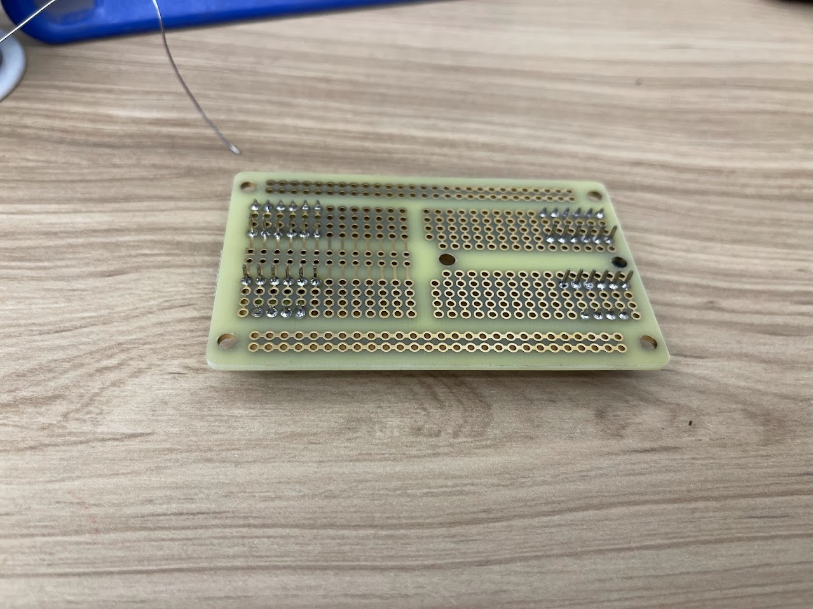

# Soldering Guide

This guide walks through the soldering requirements for components of the snow sensing station that are not already soldered together when you purchase them. It includes instructions for soldering the components of the additional analog-to-digital converters (ADCs) needed for making longwave radiation measurements and the MaxBotix sonar sensor.  
An optional soldering jumper setting on the Mayfly is also discussed.

## Required Hardware and Tools

The following hardware and tools are not explicitly called out in the hardware spreadsheets but are needed for the successful construction of a snow sensing station:

1. Breadboard: [Amazon Link](https://www.amazon.com/DEYUE-breadboard-Set-Prototype-Board/dp/B07LFD4LT6/ref=sr_1_1?crid=1DC4JWMO8ZJJY&dib=eyJ2IjoiMSJ9.jxVij6GBiI3UZ-6NpQmxYSe8hSgXCBThtl8-kiWvP-3WAVR479ujpSnnPrGnp7cUmnWXDiOtQ4phR-50BL2i1UjIniLV-IZZxGL4TpbQyZl7HSLv0v_bglYhH4-nDi4q2dBM2irJQZsNjZVsp45ZvGQZ1NRpkMMow3avvtMa5poaJjae4h3RQHu-G7xMAbMuGD0mY7QKZCUvI0Gcgym9OSW0TxVPqP694VD83nkVXtyUkbFpnQXhNhmMdNVbv5c_Q-vrcdhK-c4uRXD58dI5sZfi3NQnlcHaACsX2HjXnJk.B3AS3S1rpTwwSBDJtb058ysVtnxTsyUSe-oGa_6XJyw&dib_tag=se&keywords=breadboard&qid=1731532125&s=electronics&sprefix=breadboar%2Celectronics%2C183&sr=1-1)
2. Soldering iron kit: [Amazon Link](https://www.amazon.com/Soldering-Interchangeable-Adjustable-Temperature-Enthusiast/dp/B087767KNW/ref=sr_1_1?crid=1253VSWW6H46N&dib=eyJ2IjoiMSJ9.MNB3HuUsZOjz1NSstYQ0xYsrWEda1XgfR9bXfx1rBtjHYwVSwosZi0MNnGQsMTKnHo7etRSOAA7Fe4ZqIHhFkaw8iXVm33USmlWOqAaOmSRhJJ-EI1PWY7Y7IsYyB_ReyrY1qpsnZfaFaLPyOvkLrG8PyCQ8mC7Os7bbMw6KX6Y9oEFKkKJGDrNK8zf69w52_OCrlFg9R4JveMzz1197Xk_cDlhl6bcsgED57q8vhjs.gK3HKVOENLHOZByK3H7otcsbs5yQRwmHR36ghGGssLE&dib_tag=se&keywords=soldering%2Biron%2Bkit&qid=1731532438&sprefix=solder%2Caps%2C186&sr=8-1&th=1)
3. Solder fume extractor: [Amazon Link](https://www.amazon.com/YIHUA-Extractor-Absorber-Tiltable-Soldering/dp/B0B4CB6KRW/ref=sr_1_1?dib=eyJ2IjoiMSJ9.nfZb-SxE9A3ZLDvZFrS9P3f2pguFB6soC_NoyBhH44ZWfXSyKNhnsDazsyKV3rkWxfUr1TMra-BXLt5ubo_GJIh-a7kCreDrc8hFH29_HS9y4ZDl5KFzHVFw81lWZpNeU2Dh023MpbDnDdeXYmOPhehh24v2OSccqHt3kT3pwKoESynoxTHFsERFNnj_1BZ0B3CHpBZG3mRCGZLl4Baq45s13vL1qv2GXuOPhlAJHxw.sH5dsSyoXdfDvirtIyiJwdXuWzr0Ma28fcy23hEHOis&dib_tag=se&keywords=charcoal%2Bsoldering%2Bvent&qid=1731533409&sr=8-1&th=1)
4. A small piece of cardboard
5. A pocket knife

**Note that there are inherent risks with soldering!** Make sure you learn proper technique and safety when soldering. Work in a well-ventilated area. 

Use a fume extractor to avoid breathing toxic gases, and wear safety glasses incase any solder splashes. **Also do not solder any live circuits.** 

Here are some beginner soldering videos for reference:  
* [https://www.youtube.com/watch?v=3jAw41LRBxU](https://www.youtube.com/watch?v=3jAw41LRBxU)
* [https://www.youtube.com/watch?v=6rmErwU5E-k](https://www.youtube.com/watch?v=6rmErwU5E-k)  

## Required Soldering

The following steps are covered in this guide. Links to the sections are provided here for convenience:

1. [Soldering the ADCs](#1-soldering-the-adcs)
2. [Soldering the Maxbotics Sensor Cable](#2-soldering-the-maxbotix-sensor-cable)
3. [Optional Soldering](#3-optional-soldering)

### 1. Soldering the ADCs
1. Unpack both ADCs from Adafruit and their header pins.

2. Using a pocket knife, cut the header pins in half so they are 6 across.

3. Insert the longer end of the header pins into a breadboard straddling the center and one extra row on each side. The breadboard is simply for convenience and to hold the headers while you are soldering the headers in place.

4. Place the ADCs over the header pins

5. Solder both the ADCs' header pins

6. Get out the solderable breadboard

7. Place the ADCs in the solderable prototyping breadboard as shown and flip it over

8. Solder the header pins to the solderable Breadboard

9. Place the four 6-pin screw terminals so they line up with each of the pin headers on both ADCs. Make sure the gates face outwards.

10. It is difficult to flip this over and keep everything in place, so take a piece of cardboard and lay it over the board with everything upright.

11. Flip it over to reveal the underside of the breadboard and solder the pins

### 2. Soldering the MaxBotix Sensor Cable

1. Strip the outer conduit of the PVC jacketed wire to expose all the individual wires inside.

2. Take enough conduit off to provide a couple of inches of wiring and cut all the wires down to the outer conduit excluding the white, black, and red wires which will be used.

3. Strip the red, black, and white wires to expose approximately 0.25 inches of conductor wire and and twist the ends to ensure that they are not frayed.

4. Stick the black wire in the MaxBotix hole farthest away from the hole with a square metal pad, then stick in the red, then the white. Solder these wires.

**NOTE:** You may need to cut the header pins a small amount after soldering them to the board when you put it in the enclosure to mount it. The pins may be too long for the command strips to make contact between the board and the enclosure otherwise.

### 3. Optional Soldering

You may add some functionality to your Mayfly if you desire. The following steps will enable your Mayfly to turn on a white LED near the top of the board when power is supplied to the Bee header.  This is only useful if you are using XBee radio modules for adding telemetry to your snow sensing station. Completing this step is useful for visually verifying that any Bee modules being used are actually being powered. Note that this will still be on even if the radio module is in sleep mode. This light comes on any time pin 18 is driven high to supply power to the Bee module header.  

**NOTE:** Putting the XBee to sleep in code does not mean that the Bee module socket is not still supplied with power, so the LED will still light up during those times if you make this adjustment.

1. Flip over your Mayfly datalogger to reveal the jumpers on the back.

2. Locate the SJ16 soldering area (LED7) on the back. It should be on the far right side and outline two small, metal pads.

3. Solder the two pads together with a very small amount of solder to connect them.

That's it. Soldering of the components for your station should be complete. Use the following link to return the Getting Started Guide to continue the next step.

[Back to the Getting Started Guide](../docs/getting_started.md)
