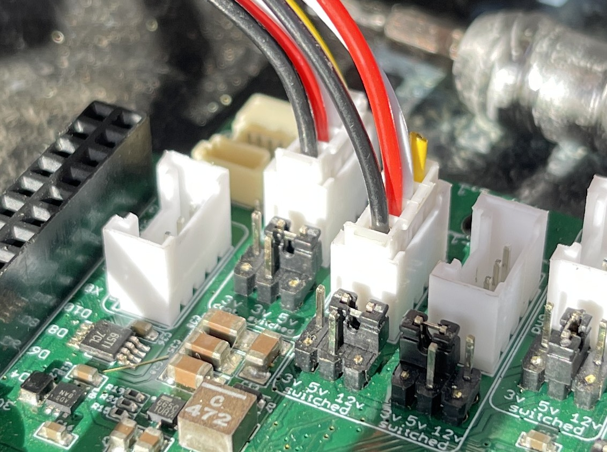
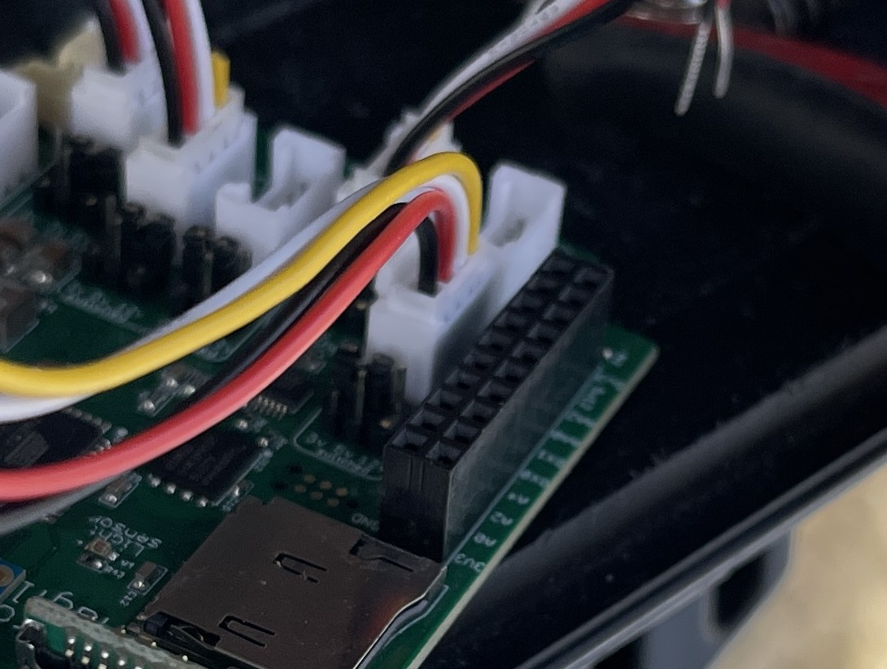

# Wiring Guide

The steps in this guide are meant to be completed after construction of your station is complete. Follow the instructions in the [Construction Guide](construction_guide.md) and the [Soldering Guide](soldering_guide.md) before continuing here. If you want to test the wiring and programming of your station before you deploy it in the field for data collection, you can follow this wiring guide in a laboratory setting, but note that you may need to disasseble and reassemble some wiring when you do the final deployment at your field data collection location.

**NOTE:** This setup assumes a Solperk charge controller ([Link](https://www.amazon.com/SOLPERK-Controller-Waterproof-Intelligent-Regulator/dp/B0946MWYPK?ref_=ast_sto_dp)) is being used. Your implementation may look a little different if using a different charge controller, but the principles are the same. Also note that in these instructions a blue radio module and small whip antenna is placed on the Bee header of the Mayfly being used. A Bee module is not required for wiring a standalone data collection station, but may be used if you will be integrating some form of wireless data transmission.

## Required Tools and Hardware:
The following hardware and tools are not explicitly called out in the hardware spreadsheets but are needed for the successful construction of a snow sensing station:
* Wire stripper
* Screw driver kit
* Stereo jack converters: [EnviroDIY Link](https://www.envirodiy.org/product/envirodiy-grove-to-3-5mm-stereo-jack-pack-of-5/)
* Soldered ADC development board
* 2 I2C Qwiic cables (preferably one long and one short): [Amazon Link](https://www.amazon.com/gp/product/B08HQ1VSVL/ref=ppx_yo_dt_b_asin_title_o09_s00?ie=UTF8&psc=1)
* 2 male-to-male jumper cables: [Amazon Link](https://www.amazon.com/Elegoo-EL-CP-004-Multicolored-Breadboard-arduino/dp/B01EV70C78/ref=sr_1_10?crid=219Y06Z2J6AAA&keywords=jumper%2Bcables%2Bsolder&qid=1699429168&sprefix=jumper%2Bcables%2Bsolder%2Caps%2C135&sr=8-10&th=1)
* Package of 3-port lever wire connectors: [Lowe's Link](https://www.lowes.com/pd/IDEAL-Lever-Wire-Connectors-3-Ports-Clear-10-Pack/5014013101)
* Red primary wire: [Lowe's Link](https://www.lowes.com/pd/Southwire-24-ft-16-AWG-Stranded-Red-GPT-Primary-Wire/1001833938)
* Black primary wire: [Lowe's Link](https://www.lowes.com/pd/Southwire-24-ft-16-AWG-Stranded-Black-GPT-Primary-Wire/1001833882)
* Alligator clips (these should come with the purchase of a Solperk charge controller, but if you are not using this regulator, you will need to purchase some): [Amazon Link](https://www.amazon.com/dp/B0BG7RCC11/ref=sspa_dk_detail_3?psc=1&pd_rd_i=B0BG7RCC11&pd_rd_w=QWtkO&content-id=amzn1.sym.8c2f9165-8e93-42a1-8313-73d3809141a2&pf_rd_p=8c2f9165-8e93-42a1-8313-73d3809141a2&pf_rd_r=GVQ4VSGMPZ5580B94H6R&pd_rd_wg=RYreD&pd_rd_r=7bf77edd-0de5-486a-8d0c-8c2176a66427&sp_csd=d2lkZ2V0TmFtZT1zcF9kZXRhaWw)
* Grove screw terminal: [Seeed Link](https://www.seeedstudio.com/Grove-Screw-Terminal.html) 

## Required Wiring

The following steps are covered in this guide. Links to the sections are provided here for convenience:

1. [Prepare the Alligator Clips for the Battery Connection](#1-prepare-the-alligator-clips-for-the-battery-connection)
2. [Connect the External ADC Boards](#2-connect-the-external-adc-boards)
3. [Prepare the Charge Controller and Connect the Battery](#3-prepare-the-charge-controller-and-connect-the-battery)
4. [Prepare the Buck Power Converter and Power Relay](#4-prepare-the-buck-power-converter-and-power-relay)
5. [Prepare Stereo Jack Connectors and Connect Soil Sensors](#5-prepare-stereo-jack-connectors-and-connect-soil-sensors)
6. [Connect the Maxbotix Snow Depth Sensor](#6-connect-the-maxbotix-snow-depth-sensor)
7. [Connect the External ADCs and Radiation Sensors](#7-connect-the-external-adcs-and-radiation-sensors)
8. [Connecting the Solar Panel](#8-connecting-the-solar-panel)

### 1. Prepare the Alligator Clips for the Battery Connection

1. Take the two alligator clips and cut their wires about five inches from the their ends. This is to help the wire get through the enclosure cable glands.

2. Strip enough of the wire sheath to stick into a 3-lever wire connector by opening the lever to permit entry and then snapping the lever down to clamp onto the wire. You may need to twist the end of the wire to make it sturdy enough to get in.

3. Clamp the alligator clips onto the battery terminals, matching the colors.

### 2. Connect the External ADC Boards

1. Take the soldered ADC development board and a small Qwiic connector cable.

2. Connect the two boards with the Qwiic connector cable as shown.

3. Address the ADCs by taking two jumper cables and connect one board's address pin (ADDR) to its power supply pin (VIN) and the other board's address pin (ADDR) to the serial data line (SDA). It does not matter which board is which, as long as they are different.

### 3. Prepare the Charge Controller and Connect the Battery

1. Cut the ends off the Solperk charge controller wires leaving as much wire as possible.

2. Pull apart the coupled wires. Srip approximately 0.25 inch of conductor on each wire and twist the ends to make sure they are not frayed.

3. Stick each wire in its own 3-lever wire connector. It does not matter which port you use.

4. Cut a length of black primary wire that can reach from the charge controller to the battery. Strip approximately 0.25 inch on the ends of this wire. Twist the strands to make sure they are not frayed.

5. Cut a length of red primary wire that can reach from the charge controller to the battery. Strip approximately 0.25 inch on the ends of this wire. Twist the strands to make sure they are not frayed.

6. Attach these wires to their respective colors of the charge controller's battery wires using the already placed lever connectors. The battery wires are indicated by a battery icon and should the middle pair of red and black wires.

7. Run these wires through the cable glands over to the battery enclosure. Connect the black wire to the negative battery terminal, also indicated with the color black, and connect the red wire to the positive terminal, indicated with red.

### 4. Prepare the Buck Power Converter and Power Relay

1. Strip the ends of the buck converter and attach them to one of the free ports on the charge controller's load output wires which are the pair of red and black wires on the far right. Match the colors.

2. Cut and strip two small pieces of primary wire approximately 6 inches in length. One needs to reach from the positive (red) charge controller load lever port to the latching power relay and the other from the power relay to the bottom 3-to-9 lever port connector.

3. Attach one wire to the single orange lever of the bottom 3-to-9 connector and to one of the common ports of the power relay, preferably 1COM. If you use 2COM, make sure to use 2NC instead of 1NC in the following step.

4. Attach the other primary wire from the 1NC (normally closed) port to the last open port on the positive (red) line of the charge controller load wire.

5. Cut and strip a piece of black primary wire to connect the single-end blue lever of the 3-to-9 connector just used to the last free lever port of the negative (black) line of the charge controller load wire.

### 5. Prepare Stereo Jack Connectors and Connect Soil Sensors

1. Take a Grove cable and cut it in half, stripping the ends of the wires to leave approximately 0.25 inches exposed. Twist the conductor wires to make sure they are not frayed. Connect the Grove cable to the Grove terminal of a stereo jack to Grove converter.

2. Using the 3-to-9 connector that is not being used for the power relay, connect the black wire of the Grove cable you just cut and stripped to one of the 3 blue ports, the white wire to one of the yellow ports, and the red wire to one of the orange ports.

3. Repeat this process two more times until all 9 lever ports are filled. **NOTE:** In these instructions one of the stereo jack converters is replaced with a screw gate converter in case you decide to forgoe the stereo jacks and go the route of stripping the soil sensor wiring, which is shown in the next step.

4. Connect the stereo jack ends of the soil sensor cables to the stereo jack to Grove converters. It does not matter which one they are connected to. If you are not using stereo jack converters, strip the sensor sheath and connect the bare wire to the black Grove cable, the brown wire to the red Grove cable, and the yellow wire to the white Grove cable as shown. **NOTE:** You only need to do this if you have decided not to use the Grove stereo jack converters.

5. Cut and strip a long Grove cable near one of its ends to maximize the length of wire obtained.

6. Connect the unclipped end to one of the SDI-12 Grove ports on the Mayfly datalogger. Whichever one you connect it to, you need to also adjust the switched power voltage supplied to that port. Take a very fine screw driver and relocate the black jumper so that it connects the ground (center pin) to the 12-volt pin (far right). Be careful not to drop/lose this jumper!

7. Attach these SDI-12 Grove cables to the 3-to-9 connector that has the soil sensors attached to it, matching the colors accordingly.

### 6. Connect the Maxbotix Snow Depth Sensor

1. Connect a Grove screw terminal to the MaxBotix MB7374 sensor cable by connecting the black wire to GND, the red wire to VCC, and the white wire to D2.

2. Attach a Grove cable to the screw terminal that you just connected to the Maxbotix MB7374 sensor cable.

3. Attach the free end of the Grove cable from the Maxbotix MB7374 sensor cable to the D5-6 Grove terminal header on the Mayfly. Adjust the switched power jumper to the 5-volt position.

### 7. Connect the External ADCs and Radiation Sensors

1. Take a Qwiic cable and connect it to one of the Mayfly's Qwiic ports on the bottom right. It does not matter which one. Connect the other end of the Qwiic cable to one of the free ends of the ADCs on the soldered development board. It does not matter which ADC it is connected to.

2. Take a Grove cable and attach one end to the power relay.

3. Attach the other end of the power relay Grove cable to the D10-11 Grove terminal header on the Mayfly. Adjust the jumper on the Mayfly datalogger to the 5-volt position.

4. Separate the blue and clear (shield) cables of both the SL-510 and SL-610 sensors.

5. Add them as pairs to 2 blue levers on the 3-to-9 connector that is attached to the power relay. This is grounding the pyrgeometer heaters.

6. Separate the green and clear wires from the SP-710.

7. Add these as a pair to the last open blue lever port, grounding the pyranometer heaters.

8. Separate the yellow wires of both the SL-510 and the SL-610.

9. Attach these wires to their own orange lever ports of the 3-to-9 connector attached to the power relay.

10. Separate the red wire of the SP-710.

11. Attach this red wire to the last open orange lever port.

12. Take two screw gate terminals and connect Grove cables to them (one for each so each Grove cable has a free end).

13. Connect the red wire of the ST-110 air temperature sensor to the VCC port of one of the screw gate terminals, then connect the white wire of the SP-710 to the D1 (yellow) port and the black wire of the SP-710 to the D2 (white) port.

14. Attach the Grove cable of that screw gate to the inner-most auxiliary analog Grove terminal on the Mayfly datalogger. Its switched power jmper should already be at 3.3 volts, and it should stay there.

15. Take the other screw gate terminal and attach the yellow wire of the SP-710 to D1 (yellow) and the blue wire of the SP-710 to D2 (white). Take the two red wires from the SL-510 and the SL-610 and attach them to VCC. Take the clear and black wires of the ST-110 and attach them to GND. Note that the clear and black wires of the ST-110 could be attached to the other screw terminal as well. It does not matter. The red wires of the SL-510/610 and the ST-110 could also be attached to either terminal.

16. Attach the Grove cable to the outer-most auxiliary analog Grove port on the Mayfly, leaving the jumper pin as is.

17. Attach the green wire of the SL-510 to A1 on the board addressed to VIN. Attach the green wire of the SL-610 to A2 of the same board. Attach the white wire of the ST-110 to A0 to this board.

18. Attach the white wire of the SL-510 to A0 of the ADC addressed to SDA. Attach the black wire of the SL-510 to A1 of the same board. Attach the white wire of the SL-610 to A2 and the black wire of the SL-610 to A3 of this board.

### 8. Connecting the Solar Panel

1. Attach the solar panel leads to the charge controller solar panel leads through the lever connector. There should be 2 lights on indicating that a battery is attached and that loads can be run, and if there is solar power then a third light will come on (the light on the left).

That's it. Wiring of the components for your station should be complete. You will want to very carefully close the lid to your enclosure to make sure that you do not disturb any of the wiring you just completed. When you do your final field deployment, you should also add dessicant packs to your enclosure to ensure that any moisture that might make its way into your enclosure does not impact the electronic components.

Use the following link to return the Getting Started Guide to continue the next step.

[Back to the Getting Started Guide](../docs/getting_started.md)
