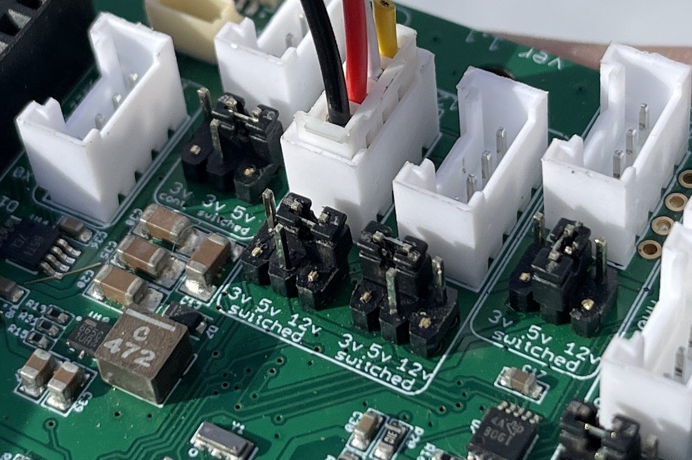

### Wiring Guide

The steps in this guide are meant to be completed after the construction is done. Follow the instructions in the  and the  before continuing here. Note that this setup assumes a Solperk charge controller ([Link](https://www.amazon.com/SOLPERK-Controller-Waterproof-Intelligent-Regulator/dp/B0946MWYPK?ref_=ast_sto_dp)) is being used. Your implementation may look a little different if using a different charge controller, but the principles are the same. Also note that in these instructions a blue radio module and small whip antenna is placed on the Bee header of the Mayfly being used. Any Bee module is not inherently necessary for wiring a standalone station, but may be used if you will be integrating some form of wireless data transmission.

Necessary tools and hardware:
- Wire stripper
- Screw driver kit
- Stereo jack converters: [EnviroDIY Link](https://www.envirodiy.org/product/envirodiy-grove-to-3-5mm-stereo-jack-pack-of-5/)
- Soldered ADC development board
- 2 I2C Qwiic cables (preferably one long and one short): [Amazon Link](https://www.amazon.com/gp/product/B08HQ1VSVL/ref=ppx_yo_dt_b_asin_title_o09_s00?ie=UTF8&psc=1)
- 2 male-to-male jumper cables: [Amazon Link](https://www.amazon.com/Elegoo-EL-CP-004-Multicolored-Breadboard-arduino/dp/B01EV70C78/ref=sr_1_10?crid=219Y06Z2J6AAA&keywords=jumper%2Bcables%2Bsolder&qid=1699429168&sprefix=jumper%2Bcables%2Bsolder%2Caps%2C135&sr=8-10&th=1)
- Package of 3-port lever wire connectors: [Lowe's Link](https://www.lowes.com/pd/IDEAL-Lever-Wire-Connectors-3-Ports-Clear-10-Pack/5014013101)
- Red primary wire: [Lowe's Link](https://www.lowes.com/pd/Southwire-24-ft-16-AWG-Stranded-Red-GPT-Primary-Wire/1001833938)
- Black primary wire: [Lowe's Link](https://www.lowes.com/pd/Southwire-24-ft-16-AWG-Stranded-Black-GPT-Primary-Wire/1001833882)
- Alligator clips (these should come with the purchase of a Solperk charge controller, but if you are not using this regulator, you will need to purchase some): [Amazon Link](https://www.amazon.com/dp/B0BG7RCC11/ref=sspa_dk_detail_3?psc=1&pd_rd_i=B0BG7RCC11&pd_rd_w=QWtkO&content-id=amzn1.sym.8c2f9165-8e93-42a1-8313-73d3809141a2&pf_rd_p=8c2f9165-8e93-42a1-8313-73d3809141a2&pf_rd_r=GVQ4VSGMPZ5580B94H6R&pd_rd_wg=RYreD&pd_rd_r=7bf77edd-0de5-486a-8d0c-8c2176a66427&sp_csd=d2lkZ2V0TmFtZT1zcF9kZXRhaWw)
- Grove screw terminal: [Seeed Link](https://www.seeedstudio.com/Grove-Screw-Terminal.html) 

1. Take the two alligator clips and cut their wires about five inches from the their ends. This is to help the wire get through the enclosure cable glands.

2. Strip enough of the wire sheath to stick into a 3-lever wire connector by opening the lever to permit entry and then snapping the lever down to clamp onto the wire. You may need to twist the end of the wire to make it sturdy enough to get in.

3. Clamp the alligator clips onto the battery nodes, matching the colors.

4. Take the soldered ADC development board and a small Qwiic cable.

5. Connec the two boards with the Qwiic cable.

6. Address the ADCs by taking two jumper cables and connect one board's address pin (ADDR) to its power supply pin (VIN) and the other board's address pin (ADDR) to the serial data line (SDA). It does not matter which board is which, as long as they are different.

7. Cut the ends off the Solperk charge controller wires leaving as much wire as possible.

8. Pull apart the coupled wires and strip and twist the ends.

9. Stick each wire in its own 3-lever wire connector. It does not matter which port you use.

10. Cut a length of black primary wire that can reach from the charge controller to the battery. Strip the ends of this wire.

11. Cut a length of red primary wire that can reach from the charge controller to the battery. Strip the ends of this wire.

12. Attach these wires to their respective colors of the charge controller's battery wires using the already placed lever connectors. The battery wires are indicated by a battery icon and should the middle pair of red and black wires.

13. Run these wires through the cable glands over to the battery enclosure. Connect the black wire to the negative battery terminal, also indicated with the color black, and connect the red wire to the positive terminal, indicated with red.

14. Strip the ends of the buck converter and attach them to one of the free ports on the charge controllers load output wires which are the pair of red and black wires on the far right. Match the colors.

15. Cut and strip two small pieces of primary wire. One needs to reach from the positive (red) charge controller load lever port to the latching power relay and the other from the power relay to the bottom 3-to-9 lever port connector.

16. Attach one wire to the single orange lever of the bottom 3-to-9 connector and to one of the common ports of the power relay, preferably 1COM. If you use 2COM, make sure to use 2NC instead of 1NC in the following step.

17. Attach the other primary wire from the 1NC (normally closed) port to the last open port on the positive (red) line of the charge controller load wire.

18. Cut and strip a piece of black primary wire to connect the single-end blue lever of the 3-to-9 connector just used to the last free lever port of the negative (black) line of the charge controller load wire.
19. Take a Grove cable and cut it in half, stripping the ends. Connec the cable to the Grove terminal of a stereo jack to grove converter.

20. Using the 3-to-9 connector that is not being used for the power relay, connect the black wire of the Grove cable to one of the 3 blue ports, the white wire to one of the yellow ports, and the red wire to one of the orange ports.

21. Repeat this process two more times until all 9 lever ports are filled. Note in these instructions one of the stereo jack converters is replaced with a screw gate converter in case you forgoe the stereo jacks and go the route of stripping the soil sensor wiring, which is shown in the next step.
22. Connect the soil sensors to the converters. It does not matter which one they are connected to. If you are not using stereo jack converters, strip the sensor sheath and connect the bare wire to the black Grove cable, the brown wire to the red Grove cable, and the yellow wire to the white Grove cable.

23. Cut and strip a long Grove cable near one of its ends to maximize the length obtained.

24. Connect the unclipped end to one of the SDI-12 Grove ports on the Mayfly. Whichever one you connect it to, you need to also adjust the switched power voltage supplied to that port. Take a very fine screw driver and relocate the black jumper so that it connects the ground (center pin) to the 12-volt pin (far right). Be careful not to drop/lose this jumper!

25. Attach these SDI-12 Grove cables to the 3-to-9 connector that has the soil sensors attached to it, matching the colors accordingly.
26. Connect a Grove screw terminal to the MaxBotix MB7374 by connecting the black wire to GND, the red wire to VCC, and the white wire to D2.

27. Attach a Grove cable to the screw terminal of the MB7374.

28. Attach the Grove cable of the MB7374 to the D5-6 Grove terminal header on the Mayfly. Adjust the switched power jumper to the 5-volt position.

29. Take a Qwiic cable and connect it to one of the Mayfly's Qwiic ports on the bottom right. It does not matter which one. Connect the other end of the cable to one of the free ends of the ADCs on the soldered development board. It does not matter which ADC it is connected to.

30. Take a Grove cable and attach one end to the power relay.

31. Attach the other end of the power relay Grove cable to the D10-11 Grove terminal header on the Mayfly. Adjust the header to the 5-volt position.

32. Separate the blue and clear (shield) cables of both the SL-510 and SL-610 sensors.

33. Add them as pairs to 2 blue levers on the 3-to-9 connector that is attached to the power relay. This is grounding the pyrgeometer heaters.

34. Separate the green and clear wires from the SP-710.

35. Add these as a pair to the last open blue lever port, grounding the pyranometer heaters.

36. Separate the yellow wires of both the SL-510 and the SL-610.

37. Attach these wires to their own orange lever ports of the 3-to-9 connector attached to the power relay.
38. Separate the red wire of the SP-710.

39. Attach this red wire to the last open orange lever port.
40. Take two screw gate terminals and connect Grove cables to them (one for each so each Grove cable has a free end).

41. Connect the red wire of the ST-110 air temperature sensor to the VCC port of one of the screw gate terminals, then connect the white wire of the SP-710 to the D1 (yellow) port and the black wire of the SP-710 to the D2 (white) port.

42. Attach the Grove cable of that screw gate to the inner-most auxiliary analog Grove terminal on the Mayfly. Its switched power jmper should already be at 3.3 volts, and it should stay there.

43. Take the other screw gate terminal and attach the yellow wire of the SP-710 to D1 (yellow) and the blue wire of the SP-710 to D2 (white). Take the two red wires from the SL-510 and the SL-610 and attach them to VCC. Take the clear and black wires of the ST-110 and attach them to GND. Note that the clear and black wires of the ST-110 could be attached to the other screw terminal as well. It does not matter. The red wires of the SL-510/610 and the ST-110 could also be attached to either terminal.

44. Attach the Grove cable to the outer-most auxiliary analog Grove port on the Mayfly, leaving the jumper pin as is.

45. Attach the green wire of the SL-510 to A1 on the board addressed to VIN. Attach the green wire of the SL-610 to A2 of the same board. As well attach the white wire of the ST-110 to A0 to this board.

46. Attach the white wire of the SL-510 to A0 of the ADC addressed to SDA. Attach the black wire of the SL-510 to A1 of the same board. Attach the white wire of the SL-610 to A2 and the black wire of the SL-610 to A3 of this board.

